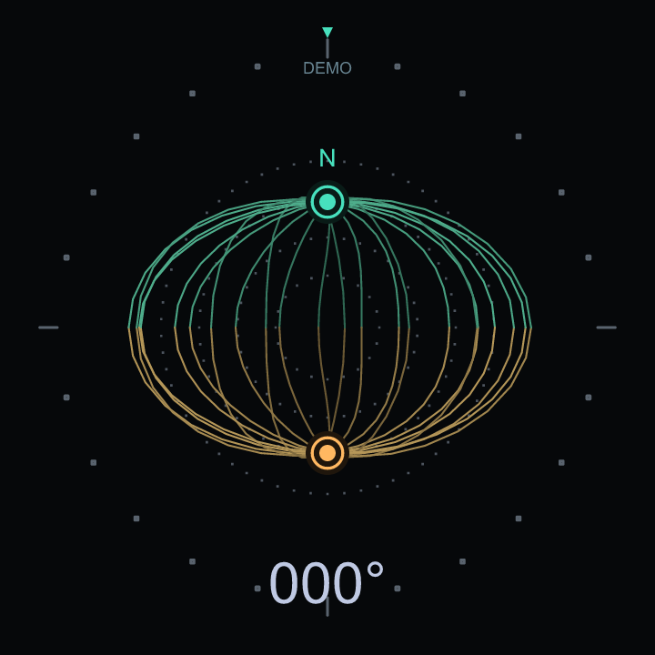

# Field Compass for Spaceagon

**Experimental first release, v0.1.0.** Desktop checks pass; sensor orientation and frame rate still need validation on a physical badge.



A native MicroPython badge app inspired by [Kind of Device's compass reel](https://www.instagram.com/reel/DdrsO2HNcq7/): fine teal and gold magnetic-field filaments, dotted concentric rings, a moving north pole and a numeric heading on the round 240 × 240 display. Tilting the badge changes the projected field; turning it bends the filaments.

The reference is a gyro-driven UI concept. This version uses the Spaceagon 2026 magnetometer when available, with a clearly labelled relative gyro fallback and an animated demo. No extra hardware or network connection is needed on Spaceagon.

## Install on Windows

1. Connect the badge's **USB IN** port with a data-capable cable.
2. In PowerShell, install the standard MicroPython tool if needed: `py -m pip install mpremote`.
3. Run `py -m mpremote connect list` and identify the badge's COM port.
4. From this project directory, or the extracted release directory, run `./install.ps1 -Port COM5`, replacing COM5 with the badge's port.
5. Hold **REBOOP** for two seconds, then open **Field Compass** in the badge launcher.

The installer copies only this app into `/apps/spaceagon_compass/`. It preserves saved calibration. If PowerShell policy blocks scripts, use the manual commands below. Installation follows the [official badge development guide](https://tildagon.badge.emfcamp.org/tildagon-apps/run-on-badge/) and [mpremote documentation](https://docs.micropython.org/en/latest/reference/mpremote.html).

Manual alternative, from the source directory:

```powershell
py -m mpremote connect COM5 fs mkdir /apps/spaceagon_compass
py -m mpremote connect COM5 fs cp app.py compass_math.py compass_view.py __init__.py dev/metadata.json tildagon.toml :/apps/spaceagon_compass/
```

If `/apps` is absent, create it first with `py -m mpremote connect COM5 fs mkdir /apps`. Skip `mkdir` when the folder already exists. After copying, use REBOOP as above. In the downloadable installation ZIP, replace `dev/metadata.json` in the copy command with `metadata.json` and run it inside the `spaceagon_compass` folder.

## Badge App Store publication

After indexing, install **Field Compass** from the badge's App Store or enter app code **02402212**. The permanent listing is [Field Compass in the badge App Store](https://apps.badge.emfcamp.org/apps/02402212/).

Public source and releases: [devnulluk/spaceagon-field-compass](https://github.com/devnulluk/spaceagon-field-compass). The repository uses the `tildagon-app` topic for discovery by the [badge App Store](https://apps.badge.emfcamp.org/), following the [official publishing guide](https://tildagon.badge.emfcamp.org/tildagon-apps/publish/).

The release source archive contains just the four native Python modules, `tildagon.toml` and the licence. `.gitattributes` excludes the desktop preview, tests, tools, installer and development metadata from the badge download. The separate installation ZIP includes the preview and USB installation instructions. In a source checkout, development metadata lives in `dev/metadata.json`.

## Controls

| Button | Action |
| --- | --- |
| A | Show or hide the control guide |
| B / E | In demo mode, turn 15° clockwise / anticlockwise and stop automatic rotation |
| C | Start calibration; press again to save sufficient coverage, then align north |
| D | Switch between live sensors and animated demo |
| F | Return to the launcher; cancel an active calibration first |

These use the physical A–F buttons on both frontboards. The Spaceagon joystick is not mapped separately.

## First calibration

1. Use live mode (**D** exits demo) and press **C**.
2. Slowly rotate the badge through all three axes, making several figure-eight motions away from magnets and nearby metal. The bar shows sample count and axis coverage, rather than a measure of accuracy.
3. Press **C**. If coverage is insufficient, keep moving and try again.
4. At **“Point top north; press C”**, hold the badge level and point the top index at magnetic north using a known compass. Let the reading settle, then press **C**.

The north-alignment step accounts for the board's sensor orientation. Calibration and the alignment offset are stored in `/data/spaceagon_compass.json`; flash is written once on completing calibration. **F** cancels without replacing previous settings. A write failure is shown on screen, with the current calibration usable until restart.

On a badge without a working magnetometer, hold still for the initial gyro zeroing. **C** rezeros this relative mode. Its zero is a local reference and it drifts; it cannot find north. **DEMO** always means simulated movement. If sensors fail, the last heading is retained and the sensor status stays visible.

The compass reports **magnetic north** with zero declination by default. Calibration removes hard-iron offsets, not soft-iron distortion. Tilt compensation assumes the accelerometer and magnetometer readings share the axes expected by the controller. The exact physical mounting orientation, compensation and rotation sign still need checking on a real badge. Firmware can also return the previous magnetic reading after an I²C read error, so identical repeated readings cannot reliably distinguish a stationary badge from a stalled driver.

## Preview and verification

Open `preview.html` for a self-contained animated desktop preview with pause, heading slider and north reset. It contains frames from the **same `compass_view.py` drawing function used by the badge**. Preview values are simulated and do not come from a connected badge. `preview.png` and `preview.svg` show the north-facing display.

```powershell
py tools/preview.py
py -m unittest discover -s tests -v
```

Preview generation needs only standard Python for HTML/SVG. PNG generation is optional and uses `resvg_py` or `cairosvg` when available. Badge files have no third-party Python dependencies.

Desktop tests cover wraparound, tilt compensation, calibration, gyro bias and drift handling, invalid/failing sensors, persistence, button flows and rendered geometry. No Spaceagon USB device was detected during development; the app has **not been installed or tested on physical hardware**, and badge frame rate remains unmeasured.

## Sources and credit

Visual inspiration: [@kindofdevice_](https://www.instagram.com/kindofdevice_/), linked reel above. This is a new implementation; the creator's source code, video, logo and audio are not included.

Hardware/API references: [official hardware guide](https://tildagon.badge.emfcamp.org/tildagon-apps/reference/badge-hardware/), [ctx drawing guide](https://tildagon.badge.emfcamp.org/tildagon-apps/reference/ctx/), [QMC6309 driver](https://github.com/emfcamp/badge-2024-software/blob/main/drivers/tildagon_imu/qmc6309/qmc6309.c), and [Spaceagon test app](https://github.com/emfcamp/badge-2026-apps-spaceagon-test). The driver already remaps the magnetic axes; the app does not repeat that transform.

Code: MIT licence, copyright 2026 Mark Brown.
